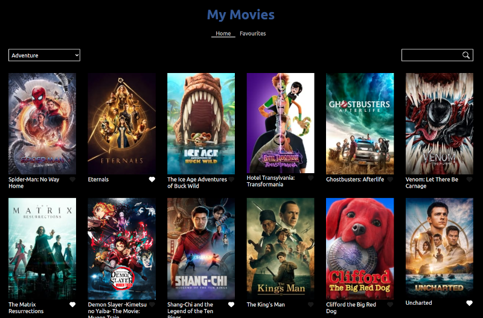

# Introduction

This app:
- Downloads movie info by genre from https://www.themoviedb.org/
- Allows the user to save favourite movies



This app requests movies by genre, and allows users to save their favourite movies to a database if the 'heart' icon at the bottom-right of a movie-card is pressed.

Favourite movies can be viewed in the 'Favourites' page.

## Tech

- Express
- MongoDB
- Mongoose
- React
- React Router
- Redux (Tool Kit)
- Tailwind
- Jest
- TypeScript
- Webpack

## Installation

- MongoDB needs to be installed
- In terminal, run: 
```
mongo
```
- Create a 'movies' database:
```
use movies
```
- Exit mongo and go to the terminal
- Start mongo:
```
sudo service mongod start
```
- Clone the repo:
```
git clone git@github.com:salis010/my-movies.git
```
- Install the required packages
```
npm i
```
- Start the server:
```
npm run start-nodemon
```
- In another terminal, start in 'development' mode:
```
npm run dev
```
- In a browser go to:
```
localhost:4000
```

## Improvements

### Error Handling

No Error handling has been implemented to notify the user when something goes wrong, such as the database is not accessible or the 'themoviedb.org' is not available. The reasons are:
- to speed up development
- the eventual notification component would probably never trigger since the 'themoviedb.org' database is pretty stable, and thus would never be experienced unless the code is made to explicitly trigger this notification

In any case, '40#' and '50#' errors could have been handled in the respective slice file by handling the rejection of a promise triggered by a thunk:

```
extraReducers: builder => {
    builder
      ...
      .addCase(fetchGenres.rejected, (state) => { 
          state.isLoading = false // loading status can also be managed here
          // activate error notification here
        })
```

### No repeat requests

Ideally, if a user downloads the first page of the 'Adventure' genre, selects another genre, and then goes back to the 'Adventure' genre, no repeat request is made, since this data could have been saved to State.

### Infinite Scrolling

For brevity's sake, this app just requests one page per genre. But inifinite scrolling with requests for subsequent pages would make more sense.

### Backend written in TypeScript

The backend code is written in JavaScript; TypeScript would have been nice. This was avoided to save time getting acquainted with Mongoose types, and installing further '@types' packages.